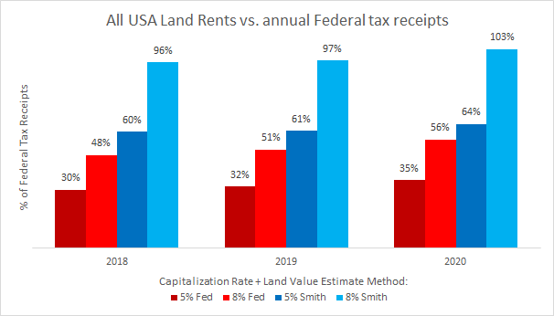
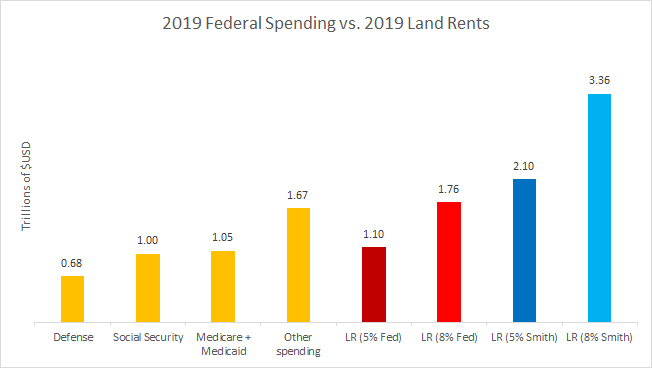
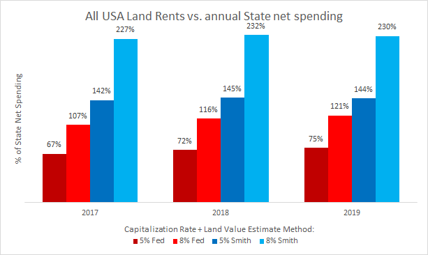
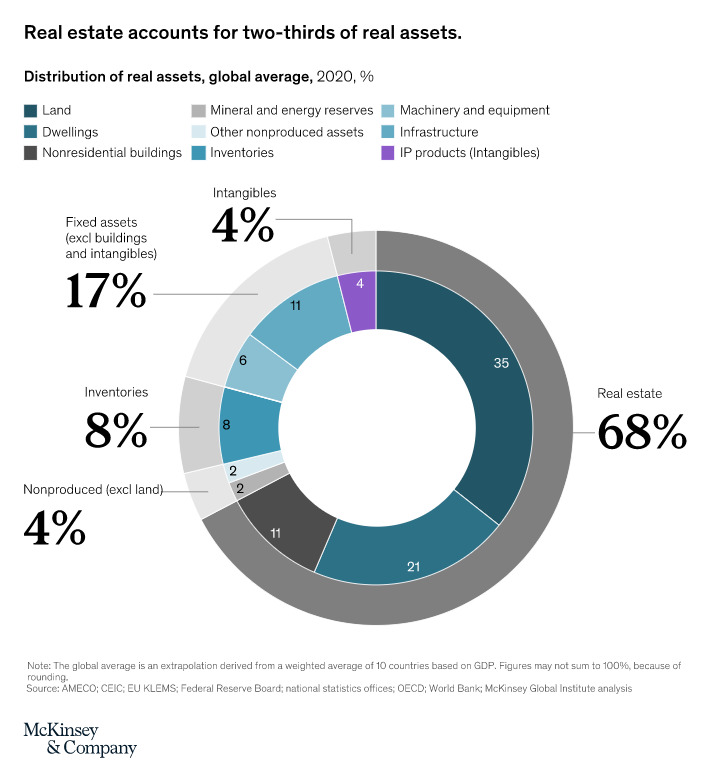
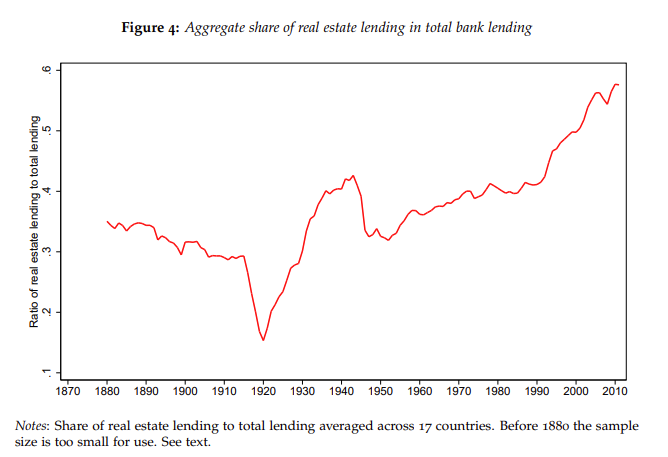
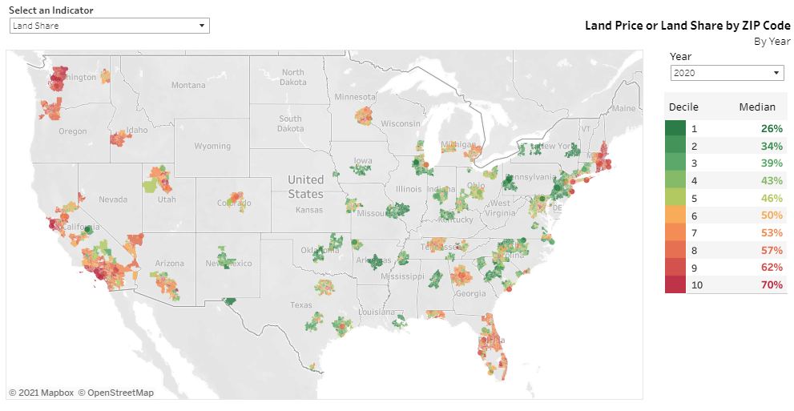
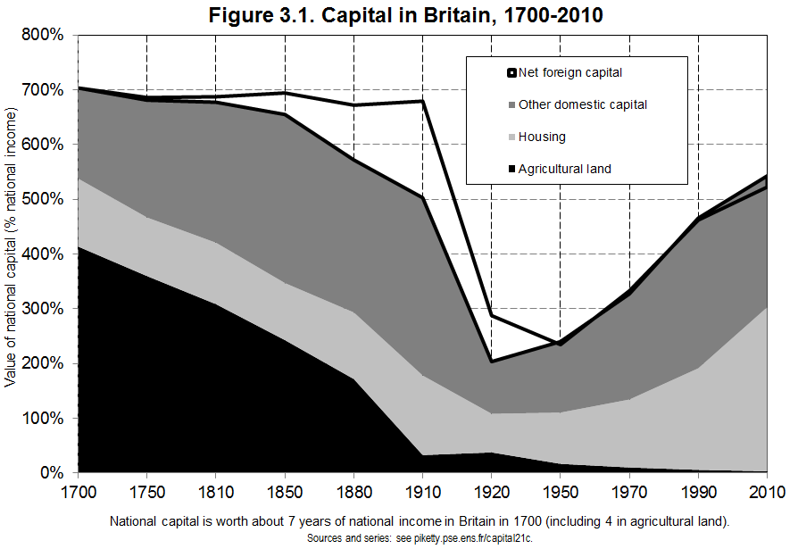
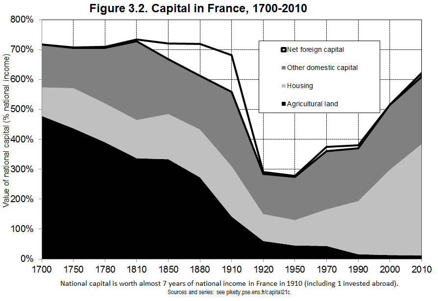
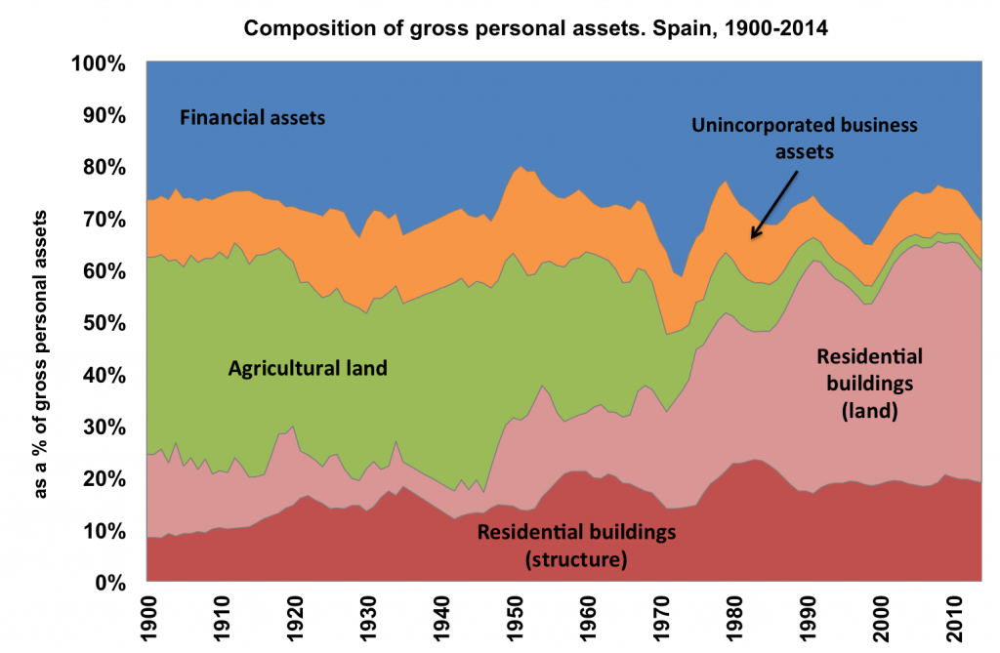
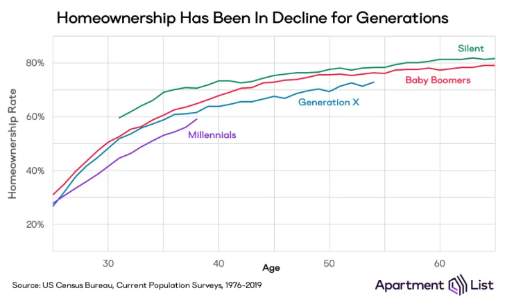

 

 

<h1>Get notified as soon as pre-orders go live:</h1>

<!-- Begin Mailchimp Signup Form -->
<link href="//cdn-images.mailchimp.com/embedcode/classic-10_7.css" rel="stylesheet" type="text/css">

<form action="https://leveluplabs.us7.list-manage.com/subscribe/post?u=89f9e9b0bb41413ed913a1ba4&amp;id=b2edb3e4a0" method="post" id="mc-embedded-subscribe-form" name="mc-embedded-subscribe-form" class="validate" target="_blank" novalidate>
    

	

	<input placeholder="Email Address" type="email" value="" name="EMAIL" class="required email" id="mce-EMAIL">

	

		

		

	
    <!-- real people should not fill this in and expect good things - do not remove this or risk form bot signups-->
    
<input type="text" name="b_89f9e9b0bb41413ed913a1ba4_b2edb3e4a0" tabindex="-1" value="">

    
<input type="submit" value="Sign Up" name="subscribe" id="mc-embedded-subscribe" class="button">

    

</form>

<!--End mc_embed_signup-->
 

 

<h1>Praise for "Land is a Big Deal":</h1>

<blockquote class="quoteleft">
Inspiring a renewal of interest in Georgist ideas whose full ramifications are yet to be determined.
<footer>—<a href="https://astralcodexten.substack.com/">Scott Alexander</a></footer>
</blockquote>

<blockquote class="quoteright">
Lars's work is intellectually fascinating and among the clearest and most compelling writing in support of land value taxes that I've seen.
<footer>—<a href="https://vitalik.ca/">Vitalik Buterin</a></footer>
</blockquote>

<blockquote class="quoteleft">
Lars Doucet has thought more deeply about land taxes than anyone I've ever met...and I've met just about everyone.
<footer>—<a href="https://noahpinion.substack.com/">Noah Smith</a></footer>
</blockquote>

<blockquote class="quoteright">
An absolutely wonderful summary of the economics of Henry George and land value taxes. Comprehensive but accessible, and above all fun!
<footer>—<a href="https://twitter.com/rethinkecon/status/1408432447931494400">Rethinking Economics</a></footer>
</blockquote>

<blockquote class="quoteleft">
Why land matters more today than ever… and why economists, urbanists & everyone else need to take Henry George Seriously.
<footer>—<a href="https://twitter.com/Richard_Florida/status/1469054290341896194">Richard Florida</a>, co-founder <a href="https://www.bloomberg.com/citylab">Bloomberg CityLab</a></footer>
</blockquote>

<blockquote class="quoteright">
Take the Georgist pill and read this.
<footer>—Arpit Gupta, author <a href="https://arpitrage.substack.com/">Arpitrage substack</a></footer>
</blockquote>

<blockquote class="quoteleft">
Have you seen the cat? Whether or not Doucet converts you to Georgism, you’ll come away with a new appreciation for how every economic system is built on the same resource: land.
<footer>—<a href="https://www.slimemoldtimemold.com">SlimeMoldTimeMold.com</a></footer>
</blockquote>

<blockquote class="quoteright">
If you've read about Henry George and his book Progress and Poverty, but never actually read them, here is your big chance to learn a lot without reading so many hundreds of pages.
<footer>—<a href="https://twitter.com/dolanecon/status/1469296694961573893">Ed Dolan</a>, Senior Fellow, <a href="https://www.niskanencenter.org/">Niskanen Center</a></footer>
</blockquote>
 

 

<h1>Synopsis</h1>

The conflicts of the last century have trained us to see capital and labor as two fundamentally opposed camps–if we want to stimulate growth and economic progress, it means squeezing workers, and if we want to take care of workers it means accepting higher taxes, more barriers to starting and running a business, and a hit to overall economic growth (or so the conventional wisdom goes).

But what if we've been missing out on a crucial piece of the puzzle, something that flips the entire script?

Take a look at this picture:

<small>(Source: Nick Hayes, used with permission)</small>

Do you see the cat?
 

Nestled in the negative space between the tree’s branches, the cat represents the hidden role of land that shapes the entire economy: once you've seen it, you can't un-see it. Land, and the policies that govern it, hold an incredible and largely forgotten power over our lives. When land is wasted and squandered, we get sky-high rents, oppressed workers, ruined businesses, depleted natural resources, a polluted earth, and an impoverished society.
 

Land is a big deal, and this book will explain the problem and what we can do to solve it.

PART I is a review and summary of Progress and Poverty, the seminal text concerning the land problem. That book was the magnum opus of 19th century American political economist and populist firebrand Henry George and was so popular in its time that many have claimed it outsold all other books except the Bible. I explain and contextualize Henry George’s philosophy for modern readers, known today as Georgism or Geoism. Then, I lay out his proposed solution to the land problem, the “Land Value Tax,” a tax on the annual rental value of land, but which excludes the value of all improvements, such as buildings.

Having established the problem and its solution, I then move on to addressing critics. There are three common practical objections that newcomers to George’s philosophy tend to raise: 1) that land just isn’t an important part of the economy anymore, 2) that Land Value Tax will just be passed on to tenants and make everything more expensive, and 3) that even if all the theory is correct, unimproved land can’t be accurately assessed in practice, so the whole project is doomed.

The next three parts address each of these objections in turn.

PART II empirically establishes that land is a big deal, not just in the 19th century, but even and especially today. First, I demonstrate that the chief component of sky-high urban real estate prices is due to land values, not buildings. Second, I collect and synthesize all the best estimates of America's total land values and demonstrate how a tax on the annual rental value of land could raise enormous sums of revenue sufficient to significantly offset or even replace existing sales, income, and capital taxes. Finally, I show the degree to which real estate has come to dominate bank lending, how housing has become the largest asset class in the world, and the degree to which landownership is concentrated among the wealthy.

PART III lays out the empirical case for Land Value Tax not being passed on to tenants. I explain the theoretical basis for this and then provide empirical evidence showing the effects of Land Value Tax policies in the real world. Counter to what is often claimed, I demonstrate that landlords not only can't, but empirically don't, simply pass on the tax to their tenants by raising rents.

PART IV evaluates the available methodology and current state of practice for assessing unimproved land values separately from buildings. I give an overview of established best practices, critique the status quo where it falls short, and present a sampling of the latest methods from the research literature that can improve upon the state of the art.

PART V concludes by reviewing all the evidence and practical case studies we've seen so far and charts a path forward for the work that lies ahead.

 

 

<h1>Details</h1>

This book has its origin in a series of guest articles posted on the website <a href="https://astralcodexten.substack.com">Astral Codex Ten</a>. The first of these was a <a href="https://astralcodexten.substack.com/p/your-book-review-progress-and-poverty">book review of <i>Progress & Poverty</i></a>, which won first place in <a href="https://astralcodexten.substack.com/p/book-review-contest-winners">the site's book review contest</a>. The site's audience was intrigued by the idea and asked for some follow-ups evaluating the empirical claims of Georgism, which resulted in the three-part series, <a href="https://astralcodexten.substack.com/p/does-georgism-work-is-land-really">"Does Georgism Work?"</a> The entire series was eventually collected and re-posted on the standalone site <a href="https://www.gameofrent.com/">Game of Rent</a>. These have now been edited and collected into this book, <i>Land is a Big Deal</i>, published by Shack Simple Press.

Here are a few key findings.

Economists across the political spectrum are in near-universal agreement about one thing: Land Value Tax is the best tax there is. Nobody creates land, but everybody needs it, and there is fierce competition for good locations in populous city centers. The general problem with taxes is that when you tax something, you get less of it. So if you tax income, you get less labor. If you tax capital, you get less investment. If you tax buildings, you get less buildings. But if you tax land, you don't get any less land. (A land value tax shouldn't be confused with a property tax, which taxes land <i>and</i> the buildings that sit upon it; land value tax only taxes the land).

In fact, <i>not</i> taxing land is a perfect recipe for speculation and ever-inflating housing prices, which infect the rest of the economy and contribute to higher costs of living and general stagnation. Land Value Tax discourages people from buying land just to hold it out of use. Instead, it encourages denser building, which has been repeatedly shown to be better for both quality of life and for the environment. Land Value Tax is a rare tax that instead of being a "necessary evil" that puts a drag on the economy, actually <i>boosts</i> it. Even better, every dollar raised by Land Value Tax is a dollar we can reduce other less efficient taxes (such as those on personal incomes) by.

So how much can Land Value Tax raise?

Conservative estimates indicate a Land Value Tax could raise an amount equal to 30-100% of all federal tax receipts:  

<small>Source: <i>Land is a Big Deal</i></small>

Put another way, on the low end that's enough to fully fund any ONE of our three major non-discretionary spending obligations: social security, healthcare, or the defense budget. On the higher end, a Land Value Tax could fully fund all three, with money left over to spare:  

<small>Source: <i>Land is a Big Deal</i></small>

If LVT is levied only at the state level, even the most pessimistic estimates would cover the majority of current state spending levels:  

<small>Source: <i>Land is a Big Deal</i></small>

This is because <i>Land is a Big Deal</i>. It's no coincidence that real estate is the world's single largest asset class:  

<small>Source: <a href="">McKinsey & Company</a></small>

...or that real estate comprises an ever-increasing majority share of bank loans:  

<small>Source: <a href="https://www.nber.org/system/files/working_papers/w20501/w20501.pdf">Jordà, Schularick, and Taylor</a></small>

And of course, the vast majority of that real estate's value is due to land:  

<small>Source: <a href="https://www.aei.org/housing/land-price-indicators/">American Enterprise Institute</a></small>

The power that aristocrats once weilded from controlling agricultural land has shifted to those who own residential land:  

<small>Source: <i>Capital in the 21st Century</i> by Thomas Piketty</small>

  

<small>Source: <i>Capital in the 21st Century</i> by Thomas Piketty</small>

  

<small>Source: <a href="https://web.archive.org/web/20180821115745/http://wid.world/wp-content/uploads/2018/02/WID.WP_ABM_WEALTHSPAIN_2018.pdf">Blanco, Bauluz, & Martínes-Toledano</a></small>

With predictable effects on the rates of generational home-ownership:  

<small>Source: Apartment List</small>

Land is a big deal. This book talks about why that's a problem, how things got this way, and what we can do about it.

<h1>Get notified as soon as pre-orders go live:</h1>

<!--
<h1>What's the big deal?</h1>

This book began its life as a <a href="https://astralcodexten.substack.com/p/does-georgism-work-is-land-really">series of guest articles</a> on the blog Astral Codex Ten that struck a nerve online and became more popular than I could ever imagine. To explain how we got from there to here, I asked two friends to lend some words of introduction for how this all came about, as well as the broader economic context in which this book sits.
 -Lars A. Doucet
  

<b>Scott Alexander, author of <a href="https://astralcodexten.substack.com">Astral Codex Ten</a> and <a href="https://slatestarcodex.com">Slate Star Codex</a>:</b> 
<i>

Who even writes forewords for books anymore? The only place I ever see forewords is in old texts, by some historian trying to explain the context in which the book was written. So in case anyone is reading this book a hundred or a thousand years in the future, here's the context.

In the 2020s, when this book was written, median US rent had gone up 20% (in real terms) over twenty years. Houses were skyrocketing in price so consistently that large investment groups were snapping up much of the available stock. Leading newspapers (an archaic form of media sort of like a blog, but more pretentious) declared "the end of the American Dream of homeownership". An elderly man with period-atypical facial hair achieved national acclaim for founding a political party called "The Rent Is Too Damn High". Urban dwellers organized into factions with names like "NIMBYs" and "YIMBYs" to fight over whether the government should allow new houses to be built.

I was a blogger during this period, and hit on the idea of running a book review contest. After getting over a hundred entries, I decided to let readers vote on the best. The overwhelming winner was a Norwegian-Texan game designer I'd never heard of, who wrote a review of Henry George's "Progress And Poverty", which explained the reasons that housing was so expensive and set out a program for solving the problem. I gave him the prize of five thousand dollars (an archaic currency sort of like Bitcoin, but less useful for buying drugs) and expected never to hear about it again.

I was wrong. There's an old optical illusion where, if you stare at it long enough, the image of a cat suddenly jumps out, so obvious that you can't understand how you missed it before. The Georgists talk about their own movement in terms of "seeing the cat" - realizing the degree to which land affects the economy is a sudden perspective shift, surprising and irreversible. Lars' entry in my book review contest caused thousands of people to see the cat at once. It ended up getting 114,000 views, being shared hundreds times on Twitter (an archaic social media site sort of like voluntarily subjecting yourself to painful electric shocks, but more addictive), and inspiring a renewal of interest in Georgist ideas whose full ramifications are yet to be determined. One of those ramifications is this book.

The really frustrating thing about Georgism is the typical response from economists (an archaic profession kind of like an oracle, but less accurate). They say sure, it is a brilliant idea, it would solve a lot of problems - but it is a nonstarter for lack of political will to carry it out, so it is doomed. They make a good point. But you can solve lack of political will by building political will - the job Lars has set for himself here.

If you're reading this book in the distant future, I hope your society has found that this movement is not so hopeless after all. And if you're reading it in the present, I hope it inspires you to become a part of that change.

  
</i>
<b>Noah Smith, Economist:</b> 
<i>

It would only be a slight exaggeration to say that humanity’s history is defined by a struggle over land. We find ourselves populating a 2-dimensional spherical surface with a fixed amount of territory. We did not create this territory (or at least, not most of it); thus, it represents the ultimate zero-sum game.

Land has value for many reasons. Some of it can be farmed. Some of it has useful minerals underneath it. Some pieces are close to valuable natural features like harbors. We’ve been fighting over these resources since the beginning of time. Individuals, tribes, nation-states and armies would try to kick each other off bits of land and claim ownership for themselves. Some of this is still going on.

Property rights help formalize and legitimize this forceful conquest. When you sell a piece of land to someone, you’re participating in a chain of peaceful land sales that began at some point in the past with a violent seizure. Unlike property rights over a house or a corporation–things made via human effort and ingenuity–property over land has always carried a slight taint of violence. This is one reason why cries for economic justice often come in the form of calls to redistribute farmland from large landlords to small farmers, or to return land to its previous owners.

But this is not the only reason why land ownership has always been suspicious. Because in addition to natural resources, there’s another key reason land has value–namely, its proximity to other land. If you build a house out in the middle of nowhere, it won’t be worth a lot; if you build it right next to Central Park, it’ll be worth millions of dollars, simply because it is situated close to a big cluster of valuable human activity.

Most of this value, too, is not created by the person who owns the land. People who were lucky enough to hold the title deeds to parcels of land in the middle of San Francisco in 1990 have seen their property values shoot up as successive booms in the information technology industry have turned their city into a high-tech business hub. Through no actions of their own, they have become rich.

This enrichment of landowners sucks value away from the workers and the businesses that created the economic value. San Francisco doesn’t just have high land prices–it has astronomical rents, which appropriate value from workers and companies and hand it to lucky landlords. These unnecessary added costs make our economy less efficient and less productive. In recent years, some residents of these overpriced cities have begun to rebel against the zoning regimes and other regulations that restrict housing supply, in order to bring rents down.

Meanwhile, economists have long searched for an elegant solution to the problems posed by land. The 19th-century scholar Henry George–himself a San Franciscan–believed that poverty itself was a result of unequal landownership, and came up with an innovative solution. George believed that taxing the value of land itself–rather than the structures or other improvements humans create on top of that land–would allow governments to relieve poverty, restore efficiency, and remedy injustice all in one stroke.

Surprisingly, more sophisticated analyses in later centuries bore the idea out. A land value tax, or LVT, has many theoretical virtues. Unlike income taxes, which can discourage people from working, an LVT wouldn’t penalize any valuable activity–since humans (mostly) don’t make land, they can’t really make any less of it. Returning the proceeds from an LVT in the form of education, infrastructure construction, and reduced corporate taxes could encourage economic growth, while paying the revenues out with anti-poverty programs could create more equitable, livable cities. 

So on paper, land value taxes are beautiful objects. But the technical challenges involved in implementing them–especially the thorny issue of assessing the value of land separately from the value of the buildings on top of it–are formidable. That’s why believers in Henry George’s big idea–who call themselves Georgists–have invested a lot of time and thought into figuring out how this might work. This book is part of that effort. 

And it is important to remember that the quest to remedy the inherent injustice of landownership is not limited to debates over land value taxes.There are many other ideas to redistribute the benefits of land–agricultural land reform, government housing construction as in Singapore, and others. 

Georgism, therefore, should be thought of as a broad movement–and one that didn’t begin in the 19th century, but has been going on for as long as humans have been fighting over scraps of the map. Turning the inherently zero-sum-game of landownership into something that supports human equality and productivity is among our greatest challenges, and a dream that must never die.

</i>
-->