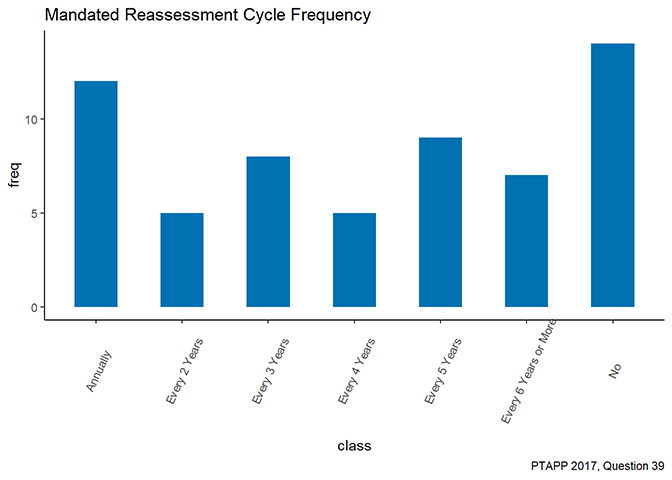
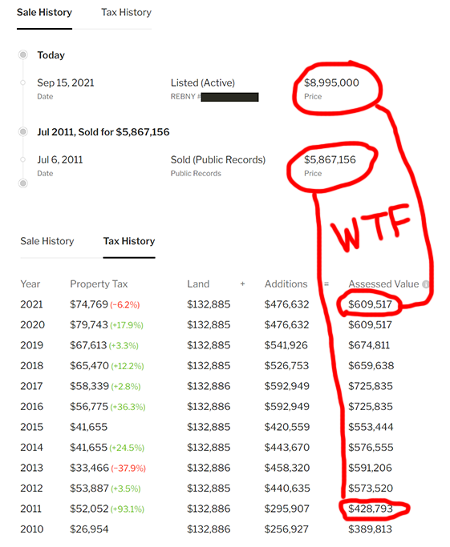
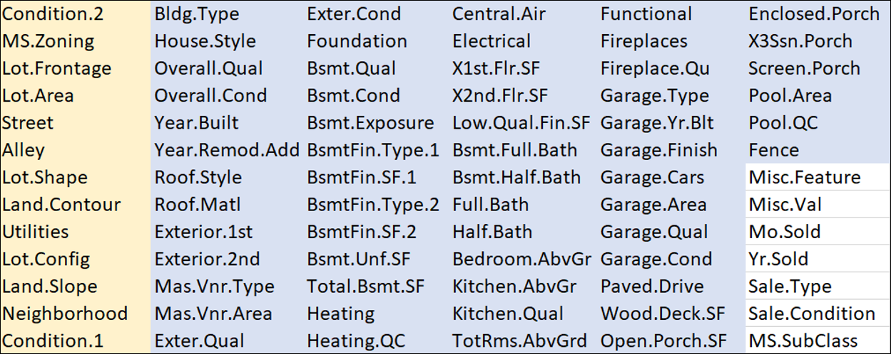
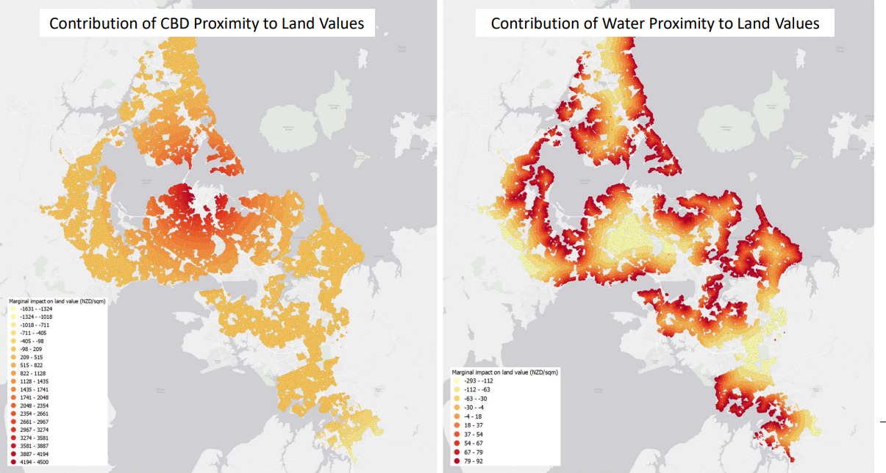
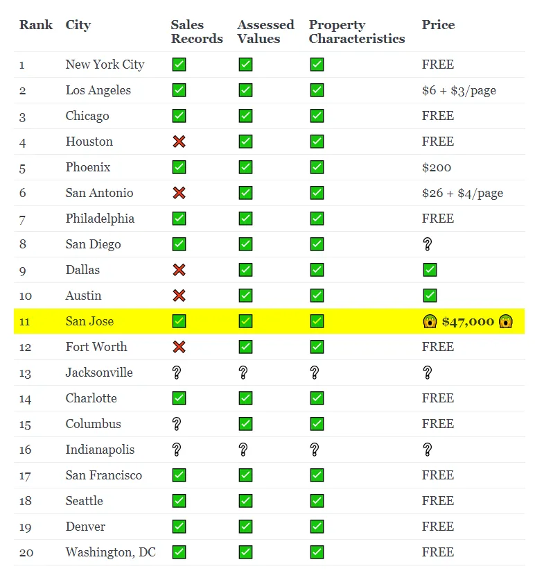

<h1>Action Plan & Research</h1>

What comes next after writing <i>Land is a Big Deal</i>? Putting together a comprehensive and credible plan for moving towards Land Value Tax policies in the United States and the rest of the world, of course. My team was <a href="https://astralcodexten.substack.com/p/acx-grants-results">awarded a grant</a> by Scott Alexander of <a href="https://astralcodexten.substack.com">Astral Codex Ten</a> to solve some of the practical issues related to implementing LVT.

So how do we actually achieve LVT policies in practice? Aren't there a host of political obstacles? And isn't the U.S. congress perpetually stuck in partisan gridlock where almost nothing gets done? How could this ever move forward?

Like this:
<ul>
<li>Start from the bottom-up, not the top-down
<li>Identify municipalities already friendly to the idea
<li>Identify practical obstacles that stand in the way
<li>Overcome those obstacles
<li>Work within the existing property tax system
<li>Observe the results and publish a case study
<li>Build on successful results to build political capital
<li>Identify the next municipality and repeat
</ul>

(Note that target municipalities do not have to be limited to the U.S. -- we are interested in implementing LVT experiments anywhere and everywhere in the world.)
  
What follows below is a rough sketch of our general plan and what we've accomplished so far in our research.

<h2>Goal: Revenue-Neutral Property Tax Shift to Land</h2>

The best immediate policy to achieve our goals is to leverage existing systems and push for split-rate property tax policies that allow local municipalities to tax land and buildings at separate rates. Crucially, the <i>exact same amount of property tax</i> will be collected, the only difference being where the tax money comes from. We favor eliminating taxes on buildings entirely, moving the full burden of taxation onto unimproved land value, but any shift that moves the needle towards land is an improvement over the status quo. "Full" Land Value Tax can wait, just achieving this would be a massive improvement over the status quo and can be truthfully framed as a moderate, pragmatic reform that works within the existing system.

A revenue-neutral property tax shift to land has the following advantages:

<ul>
  <li>It leverages existing political and taxing structure</li>
  <li>It is no more expensive or difficult to adminster than the status quo</li>
  <li>It is a modest change that has immediate measurable benefits</li>
</ul>

The <a href="https://www.lincolninst.edu/publications/other/split-rate-property-taxation-in-detroit">Lincoln Institute of Land Policy</a> has studied this in great detail in a recent report and tells us:
<blockquote>
Three technical papers produced for this study cover subjects of central importance to the City of Detroit:
tax delinquency, business formation, and property value effects.  
First, analysis of Detroit’s recent reassessment shows that tax foreclosures are reduced significantly when
effective tax rates on residential properties are lowered. Furthermore, current-year delinquency rates are
reduced, and homeownership rates increase.  
Second, an analysis of Pennsylvania municipalities that adopted split-rate tax systems shows a sizable,
statistically meaningful, and immediate increase in the number of business establishments within those
municipalities.  
Finally, the experience of Pennsylvania municipalities suggests that there is a statistically significant,
positive effect on real property market values after initial implementation, with modest declines in land
values offset by increases in the value of structures.
</blockquote>

<h2>Obstacles</h2>

Okay, sounds great! What stands in the way?

First of all, split-rate property taxes are illegal in several U.S. states, including my own home state of Texas. The Texas constitution has a clause that specifically pre-empts local municipalities from taxing land at a separate rate from buildings. So any move to shift property taxes off buildings and onto land will require an amendment to the state constitution (which thankfully is much easier than amending the U.S. constitution). Texans can and should repeal this troublesome clause, but it means that for now we will be focusing our initial efforts on municipalities with more favorable state laws (Pennsylvania is a good example of a U.S. state that does so, and Denmark is a good example of a sovereign country that allows it throughout its territory).

Second, properly taxing land values requires having a modern and up-to-date assessor's office. This is where our team comes in. Our grant project is specifically focused on the task of improving the status quo of land value assessment practices, which we have identified as a key issue standing in the way of LVT policy implementation.

 

 
<h2>The "Land Is a Big Deal" Computer-Assisted Mass Apprasial Project</h2>

We are building an open data computer-assisted mass appraisal model. This is a way to estimate the values of a lot of properties at once. We will publish all of our results, methods, and data and we will rely as much as possible on public data sources as inputs.

Improving assessments are an important lever for moving towards Land Value Tax policy for a variety of reasons: you need the data in order to levy an LVT, but you also need good data for advocacy. You can't build a winning political coalition without talking about who pays more and who pays less after a tax shift. You must come armed with data to show that a revenue neutral property tax shift to land will leave most voters better off. So even apart from actually assessing the tax, you need the data just to <i>advocate</i> for it. But there's another important reason that improving assessments are so crucial: <i>updating land value assessments can be equivalent to levying a partial LVT, without changing any laws!</i>

<h3>Aren't we doing this already?</h3>

But is this really important? Aren't most municipalities already separately value land from buildings? Indeed, in our own personal property tax records there are separate line items for land value and building value. There's a couple reasons we think the status quo could use some improvement, however.

For one, <b>the latest methods aren't available everywhere.</b> A lot of great research has come out in just the last ten years, but these methods haven't always filtered down to every municipality. There's a lot of local variation and just getting people to update to current standards can make a big difference.

Second, <b>the real problem isn’t always methods, but data</b>. Not everyone has access to good data – 12 states (including Texas) have “real estate non disclosure laws,” which hide property sales transactions data from public view. Part of our project is looking into ways to get around this.

Third, <b>many assessments are out of date</b>. Anywhere that land values haven't been updated in a long time, they are  likely to be under-assessed. Here's a slide from the <a href="https://iaao.org">International Association of Assessment Officers</a> 2017 survey about local policies, as you can see many jurisdictions do not mandate frequent re-assesssments:   

As an example, here's a listing for a property in Manhattan where the assessed land value hasn't changed in ten years, even though the market value of the property increased by $3 million during that time:  

Fourth, <b>not everyone values land separately from buildings.</b> We haven't seen separate assessments for land and and buildings in Detroit and Philadelphia's data sets, for instance.

Fifth, <b>many datasets focus heavily on building characteristics.</b> That is, the datasets focus heavily on the physical properties of the buildings, rather than the land.
Take a look at this image, for instance:  
  
This is the famous Ames Iowa dataset that’s so frequently used as a tutorial in machine learning. All the blue stuff is essentially characteristics of the building itself, and the yellow are characteristics that have to do with land, location, or proximity to things. White is metadata. 75% of this data set is building characteristics!
  
We argue that we should probably flip this mentality – focusing primarily on land characteristics. We’ll still factor in building characteristics, but they should be a secondary concern.

Finally, <b>inaccurate and infrequent assessments lead to tax revolts.</b> Land Value Tax has actually been tried in several places around the world. Unfortunately, in a few key places, such as in Pittsburgh and other places in Pennsylvania, inaccurate and infrequent property assessments have led to tax results, when a sudden hike in property values after a long delayed re-assessment causes sticker shock in the tax base. By making assessments easier, cheaper, and more accurate, we can keep them up to date and help LVT avoid this failure state.

<h3>How will we improve things?</h3>

First, we'll <b>demonstrate that land value can be accurately estimated</b> apart from building values.

Second, <b>all of our data will be open</b>. The raw inputs, the cleaned inputs, and the detailed methodology itself will be laid out clearly and publicly so anyone can pick up our work and reproduce it themselves in their own jurisdiction.
  
This is not just for the sake of adoption by assessors offices, but to make mass appraisal something that is not just for specialists and government officials. If the public can run and understand the models themselves they will be more willing to accept the assessments.

 

Third, we'll <b>align with IAAO standards & work with assessors to speak their language</b>. We don’t want to be perceived as meddlesome outsiders that want to make life hard for working assessors. We want to learn their language and align to the standards of the professional body that they are used to, the IAAO. This is why we are working with Paul Bidanset, an experienced assessor and former IAAO employee and researcher, as well as Ted Gwartney, an experienced assessor and professor of real estate appraisal.

Fourth, we'll <b>build a model that can be run cheaply and frequently.</b> Our goal is for the model to update property values at least once a year.

<h3>Our Approach</h3>

The heart of our model is to <b>value land directly</b> by focusing specifically on land based characteristics. We mean things like, “school district you are in,” “distance to public amenities like transit, parks, hospitals, etc.” As well as distance to anything desirable (green space, water) and undesirable (pollution, crime, noise, etc). The advantage of all these properties is that they don’t require you to go into people’s houses and take a bunch of measurements. You can take the location of these known feature on the map and calculate distance to them for every property. They also have the advantage of being easier to keep up to date over time.

  Here are some examples from our modeller Stephen Hoskins' prior research – this is in Auckland, New Zealand. On the left you have a map of what the independent contribution of distance to the CBD – central business district (aka, “downtown”) to the value of the land. The closer you get to the center, the higher the value.
  
On the right you have the independent contribution of proximity to water to land value. Closer to water – higher land value (as you can see, the CBD proximity has a higher impact overall).

We’re going to <b>test multiple models</b> (algorithms, that is). The simplest is MRA, multiple linear regression. This is essentially an elaboration on 7th grade algebra you’re probably already familiar with. It’s simple, it’s transparent, it’s easy to explain, and that’s why it’s a staple of assessor’s offices. We’ll also be testing more “advanced” models like boosted decision trees, neural network models, geospatial models, and more, and then compare the tradeoffs in accuracy versus explainability.

We’re also going to <b>do lots of <a href="https://www.iaao.org/media/standards/Standard_on_Ratio_Studies.pdf">ratio studies</a></b>. This is where you compare the estimated values versus what prices the properties actually go for in the market. To test land values specifically we will run tests for both <a href="https://researchexchange.iaao.org/jptaa/vol14/iss2/5/">horizontal and vertical inequities</a>, as well as plot land value maps.

<h3>What We've Done So Far</h3>

We started by <b>doing a survey of what data is even available for the top 20 US metro areas.</b> Here's an overview:  
  
Philadelphia has among the best data and best data policies in the country. Texas cities have some decent data portals and access rules but are burdened by real estate non disclosure laws. And the most onerous and restrictive municipality in the country is Santa Clara county – the seat of Silicon Valley, ironically – which charges over $40,000 just to access the same data basically everyone else gives out for free or for very cheap.
 

We’ve also <b>read a bunch of research papers</b> and <b>assembled a team of knowledgeable experts with relevant experience</b>. As for myself (Lars Doucet), I just wrote this book about how land is a really big deal, and am also an experienced computer programmer familiar with machine learning. Stephen Hoskins is our model builder, who recently submitted his Master’s thesis on the subject of what factors drive land values. <a href="https://www.linkedin.com/in/ted-gwartney-mai-56145926?original_referer=">Ted Gwartney</a> and <a href="https://www.linkedin.com/in/paulbidanset?trk=public_profile_browsemap">Paul Bidanset</a> are experienced assessors who are advising us, and <a href="https://narrativespodcast.com/">Will Jarvis</a> heads up the business side.

We've also collected a bunch of data from municipal open data portals. Here's an example of what we mean:  
  A lot of municipalities have started doing this kind of high quality centralized data gathering. Philly is probably the best, but there are many that are its peers and our method could be applied to any of them.
  We’ve done a good bit of cleaning on it as well as mapping it together with other sources of public data. Documenting this procedure into a reproducible pipeline will be one of our deliverables.

Finally, the chief economist of Redfin, Daryl Fairweather, is apparently a huge fan of Land Value Tax policy and Georgism. Will and I invited her onto our podcast and we had a great discussion about the subject:  

<iframe style="position:relative; display:block; margin:auto;" width="526" height="296" src="https://www.youtube.com/embed/C1irC3HG--U" title="Daryl Fairweather - The Housing Crisis" frameborder="0" allow="accelerometer; autoplay; clipboard-write; encrypted-media; gyroscope; picture-in-picture" allowfullscreen></iframe>  

She has said that <a href="https://twitter.com/FairweatherPhD/status/1536326965384323072">researchers should contact Redfin</a> if they want to work out a data partnership, and we’ve sent in our application. If RedFin can share their data with us, that will allow us to circumvent the real estate non disclosure laws that operate in so many areas. Our project doesn't fundamentally depend on this, mind you, and we have no idea how long it might take to work our such a partnership, or whether it will even come to fruition at all. Nevertheless, we're actively pursuing this and other such leads. If you have access to this kind of data, please reach out to us!

<h3>What's Left</h3>

So what do we still need to do? <b>Finish the models</b>, for one.

Then, we'll <b>release all our data and methodology</b> and <b>publish an academic paper.</b>

Just as important though is <b>writing a paper “for the masses”</b> – ie, more blogging and book-writing. The same kind of stuff found in <i>Land is a Big Deal.</i>

We’ll then <b>put together a detailed “how to” guide for practitioners</b> and the public to follow to reproduce our work.

Finally, if we succeed we’ll move into phase 2 – <b>generalize this model and test it in other cities</b>, and provide more tools to make this something that anyone can do, anywhere, and build it out into an open assessment movement.

Armed with a modern and fully open mass appraisal method, we'll be able to help implement Land Value Tax in municipalities across the world, with a central focus on the moderate and pragmatic revenue-neutral property tax shift to land. We will seek to aid ongoing LVT efforts in municipalities like Detroit, and expand from there.

The time for Land Value Tax has come, and by George, we're here to see it through.

 

 
<h3>Sign up here for updates on both the book & our research:</h3>
<!-- Begin Mailchimp Signup Form -->
<link href="//cdn-images.mailchimp.com/embedcode/classic-10_7.css" rel="stylesheet" type="text/css">

<form action="https://leveluplabs.us7.list-manage.com/subscribe/post?u=89f9e9b0bb41413ed913a1ba4&amp;id=b2edb3e4a0" method="post" id="mc-embedded-subscribe-form" name="mc-embedded-subscribe-form" class="validate" target="_blank" novalidate>
    

	

	<input placeholder="Email Address" type="email" value="" name="EMAIL" class="required email" id="mce-EMAIL">

	

		

		

	
    <!-- real people should not fill this in and expect good things - do not remove this or risk form bot signups-->
    
<input type="text" name="b_89f9e9b0bb41413ed913a1ba4_b2edb3e4a0" tabindex="-1" value="">

    
<input type="submit" value="Sign Up" name="subscribe" id="mc-embedded-subscribe" class="button">

    

</form>

<!--End mc_embed_signup-->
 

<h1>Contact</h3>

You can email the author at: <b>lars.doucet@landisabigdeal.com</b>

